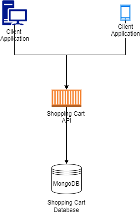
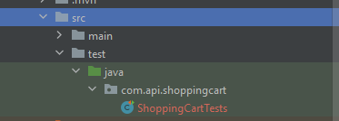
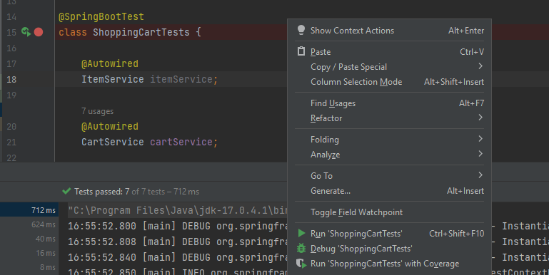

# Shopping Cart REST API

A simple REST API written using Java and his Open JDK version 17.0.4 and spring boot framework version 2.7.4. This API is the implementation for a Shopping Cart, where the customer is able to manage the complete
lifecycle of the proccess of adding, removing, deleting and calculate the final price
for the checkout.

## Problem with the Sample Test Cases

At the scenario "The customer bought 1 T-shirt, 2 Jeans and 3 Dress" the total price with
discount specified states that the value should be USD 86.95. But if the rule "..., the items that are free ... are the cheapest items" is correctly applied the final price should be USD 91.3 because the 
discount will be applied for the T-shirt (which cost's USD 12.99) and the Dress (which cost's USD 20.65)
because the Jeans is more expensive than the Dress.

## Architecture Design

<p align="center">
  <a href="#readme">
    
  </a>
</p>

The design for the system is composed by two main pieces. The REST API Shopping Cart is responsible for the impletation of the business rules. The component responsible for the state of the shopping carts is the a mongodb server. The MongoDB Database was choosed mainly because in contrast with a distributed cache for example it has a persisted storage model. Besides that, it also has a good speed of both read and write, even when the size of the database increases. We can also mention that it has a built-in sharding layer, where with a modern distributed cache like Redis, for example, we need to implement that kind of functionality.
A NoSQL database was choosed because of schemaless storage model. Whith that approach, the amount of properties present whithin any item of the items collection can be updated and the existing carts will become some kind of snapshot of the price and description of the items present whithin the cart when it was updated for the last time.

## Run Localy

To run the application locally we need have docker installed.
Whith that said you can run the following commands in order to setup the local mongo database (Windows):
```
docker-compose up
```
When the local docker database is up and runnig you can access the database through the following address:
```
http://localhost:8081/
```
The given docker compose will create the mongodb server running on port 27017 and the mongodb explorer IDE
Mongo Express which wil be running on port 8081.
Innitally there will be a predefined set of collections used to run the automated tests.
The collection "items" is used only to store the following records:

```
{
    _id: new ObjectId("6346bfa01c3d0be23964e84d"),
    name: "T-shirt",
    price:"12.99"
},
{
    _id: new ObjectId("6346bfa01c3d0be23964e84e"),
    name: "Jeans",
    price: "25.00"
},
{
    _id: new ObjectId("6346bfa01c3d0be23964e84f"),
    name: "Dress",
    price: "20.65"
}
```
The collection "carts" is used to store the shopping carts. Following is the initial state for the collection:
```
{_id: new ObjectId("6346d76fc2a561172dbc67d8"),documentNumber:"12342145632","items":[{_id:"6346bfa01c3d0be23964e84d",name:"T-shirt",price:"12.99"}],_class:"com.api.shoppingcart.domain.entities.Cart"},
  {_id: new ObjectId("6346d96431dd9b738aa27555"),documentNumber:"12342145632","items":[{_id:"6346bfa01c3d0be23964e84d",name:"T-shirt",price:"12.99"},{_id:"6346bfa01c3d0be23964e84d",name:"T-shirt",price:"12.99"}],_class:"com.api.shoppingcart.domain.entities.Cart"},
  {_id: new ObjectId("6346da65062b2a61ad75dc28"),documentNumber:"12342145632","items":[{_id:"6346bfa01c3d0be23964e84d",name:"T-shirt",price:"12.99"},{_id:"6346bfa01c3d0be23964e84d",name:"T-shirt",price:"12.99"},{_id:"6346bfa01c3d0be23964e84d",name:"T-shirt",price:"12.99"}],_class:"com.api.shoppingcart.domain.entities.Cart"},
  {_id: new ObjectId("6346f017a7c953374505c5b0"),documentNumber:"12342145632","items":[{_id:"6346bfa01c3d0be23964e84d",name:"T-shirt",price:"12.99"},{_id:"6346bfa01c3d0be23964e84d",name:"T-shirt",price:"12.99"},{_id:"6346bfa01c3d0be23964e84d",name:"T-shirt",price:"12.99"},{_id:"6346bfa01c3d0be23964e84d",name:"T-shirt",price:"12.99"}],_class:"com.api.shoppingcart.domain.entities.Cart"},
  {_id: new ObjectId("6346f079a7c953374505c5b1"),documentNumber:"12342145632","items":[{_id:"6346bfa01c3d0be23964e84d",name:"T-shirt",price:"12.99"},{_id:"6346bfa01c3d0be23964e84d",name:"T-shirt",price:"12.99"},{_id:"6346bfa01c3d0be23964e84e",name:"Jeans",price:"25.00"},{_id:"6346bfa01c3d0be23964e84e",name:"Jeans",price:"25.00"}],_class:"com.api.shoppingcart.domain.entities.Cart"},
  {_id: new ObjectId("6346f120a7c953374505c5b2"),documentNumber:"12342145632","items":[{_id:"6346bfa01c3d0be23964e84d",name:"T-shirt",price:"12.99"},{_id:"6346bfa01c3d0be23964e84e",name:"Jeans",price:"25.00"},{_id:"6346bfa01c3d0be23964e84e",name:"Jeans",price:"25.00"},{_id:"6346bfa01c3d0be23964e84e",name:"Jeans",price:"25.00"},{_id:"6346bfa01c3d0be23964e84f",name:"Dress",price:"20.65"},{_id:"6346bfa01c3d0be23964e84f",name:"Dress",price:"20.65"},{_id:"6346bfa01c3d0be23964e84f",name:"Dress",price:"20.65"}],_class:"com.api.shoppingcart.domain.entities.Cart"},
  {_id: new ObjectId("6346f1f0a7c953374505c5b3"),documentNumber:"12342145632","items":[{_id:"6346bfa01c3d0be23964e84f",name:"Dress",price:"20.65"},{_id:"6346bfa01c3d0be23964e84f",name:"Dress",price:"20.65"},{_id:"6346bfa01c3d0be23964e84f",name:"Dress",price:"20.65"},{_id:"6346bfa01c3d0be23964e84e",name:"Jeans",price:"25.00"},{_id:"6346bfa01c3d0be23964e84e",name:"Jeans",price:"25.00"},{_id:"6346bfa01c3d0be23964e84d",name:"T-shirt",price:"12.99"}],_class:"com.api.shoppingcart.domain.entities.Cart"}
```
Whith the database setup completed you can execute the application in a Java IDE installed in an environment where the Java 17 SDK is available.
During the tests the IDE IntelliJ IDEA 2022.2.3 (Community Edition) was used.

We are also providing a postman collection file whithin this repository available in the file "ShoppingCart.postman_collection".

## Tests

The automated tests are available whithin the class ShoppingCartTests:
<p align="center">
  <a href="#readme">
    
  </a>
</p>

To debug the tests you can right click inside the class ShoppingCartTests and click over the option "Debug 'ShoppingCartTests'":
<p align="center">
  <a href="#readme">
    
  </a>
</p>

The tests will change the state of the database. In order to reset the state of the database we nesse to recreate it:

```
docker-compose down --volumes
docker-compose up
```

After that you can re-run the tests again with the spected state.

## Actions Available

In this section we give a short explanation about the actions available whitin the Shopping Cart API.

### - GET /api/v1/items
This action gets the availablem items.
#### REQUEST EXAMPLE
```
GET /api/v1/items HTTP/1.1
User-Agent: PostmanRuntime/7.29.2
Accept: */*
Postman-Token: 3bab2b4b-89d8-40aa-8517-d4259bcca899
Host: localhost:8080
Accept-Encoding: gzip, deflate, br
Connection: keep-alive
```
#### RESPONSE EXAMPLE
```
HTTP/1.1 200 OK
Content-Type: application/json
Transfer-Encoding: chunked
Date: Wed, 12 Oct 2022 19:00:55 GMT
Keep-Alive: timeout=60
Connection: keep-alive
 
[{"id":"6346bfa01c3d0be23964e84d","name":"T-shirt","price":12.99},{"id":"6346bfa01c3d0be23964e84e","name":"Jeans","price":25.00},{"id":"6346bfa01c3d0be23964e84f","name":"Dress","price":20.65}]
```

### - POST /api/v1/carts
This action creates the cart.
#### REQUEST EXAMPLE
```
POST /api/v1/carts HTTP/1.1
Content-Type: application/json
User-Agent: PostmanRuntime/7.29.2
Accept: */*
Postman-Token: 2ac5ecc3-b250-44c0-a678-c0b5b7741d04
Host: localhost:8080
Accept-Encoding: gzip, deflate, br
Connection: keep-alive
Content-Length: 41
 
{
"documentNumber": "12342145632"
}
```
#### RESPONSE EXAMPLE
```
HTTP/1.1 200 OK
Content-Type: application/json
Transfer-Encoding: chunked
Date: Wed, 12 Oct 2022 19:03:11 GMT
Keep-Alive: timeout=60
Connection: keep-alive
 
{"id":"63470f6f074d0e3a83447dc0","documentNumber":"12342145632","items":null,"totalPriceWithDiscount":null}
```

### - PUT /api/v1/carts/{cart_id}/items/{item_id}
This is the operation called every time the client wants to add a new
item into an existing cart. 
#### REQUEST EXAMPLE
```
PUT /api/v1/carts/6346f1f0a7c953374505c5b3/items/6346bfa01c3d0be23964e84d HTTP/1.1
User-Agent: PostmanRuntime/7.29.2
Accept: */*
Postman-Token: 1c3aef2c-19a5-4b42-a87f-acaebdb42db9
Host: localhost:8080
Accept-Encoding: gzip, deflate, br
Connection: keep-alive
Content-Length: 0
```
#### RESPONSE EXAMPLE
```
HTTP/1.1 200 OK
Content-Type: application/json
Transfer-Encoding: chunked
Date: Wed, 12 Oct 2022 19:04:32 GMT
Keep-Alive: timeout=60
Connection: keep-alive
 
{"id":"6346f1f0a7c953374505c5b3","documentNumber":"12342145632","items":[{"id":"6346bfa01c3d0be23964e84f","name":"Dress","price":20.65},{"id":"6346bfa01c3d0be23964e84f","name":"Dress","price":20.65},{"id":"6346bfa01c3d0be23964e84f","name":"Dress","price":20.65},{"id":"6346bfa01c3d0be23964e84e","name":"Jeans","price":25.00},{"id":"6346bfa01c3d0be23964e84e","name":"Jeans","price":25.00},{"id":"6346bfa01c3d0be23964e84d","name":"T-shirt","price":12.99},{"id":"6346bfa01c3d0be23964e84d","name":"T-shirt","price":12.99}],"totalPriceWithDiscount":null}
```

### - DELETE /api/v1/carts/{cart_id}/items/{item_id}
This is the operation called in order to remove an item present into an
existing shopping cart.
#### REQUEST EXAMPLE
```
DELETE /api/v1/carts/6346f120a7c953374505c5b2/items/6346bfa01c3d0be23964e84e HTTP/1.1
User-Agent: PostmanRuntime/7.29.2
Accept: */*
Postman-Token: fc7b570d-f0b6-44f5-be5c-f58db15abfee
Host: localhost:8080
Accept-Encoding: gzip, deflate, br
Connection: keep-alive
```
#### RESPONSE EXAMPLE
```
HTTP/1.1 200 OK
Content-Type: application/json
Transfer-Encoding: chunked
Date: Wed, 12 Oct 2022 19:06:37 GMT
Keep-Alive: timeout=60
Connection: keep-alive
 
{"id":"6346f120a7c953374505c5b2","documentNumber":"12342145632","items":[{"id":"6346bfa01c3d0be23964e84d","name":"T-shirt","price":12.99},{"id":"6346bfa01c3d0be23964e84e","name":"Jeans","price":25.00},{"id":"6346bfa01c3d0be23964e84e","name":"Jeans","price":25.00},{"id":"6346bfa01c3d0be23964e84f","name":"Dress","price":20.65},{"id":"6346bfa01c3d0be23964e84f","name":"Dress","price":20.65},{"id":"6346bfa01c3d0be23964e84f","name":"Dress","price":20.65},{"id":"6346bfa01c3d0be23964e84e","name":"Jeans","price":25.00},{"id":"6346bfa01c3d0be23964e84e","name":"Jeans","price":25.00}],"totalPriceWithDiscount":null}
```

### - GET /api/v1/carts/{cart_id}
This is the operation called in order to retrieve the items present into an
existing shopping cart.
#### REQUEST EXAMPLE
```
GET /api/v1/carts/6346da65062b2a61ad75dc28 HTTP/1.1
User-Agent: PostmanRuntime/7.29.2
Accept: */*
Postman-Token: 5fad2121-192f-41b3-9f5b-7fbd717c433e
Host: localhost:8080
Accept-Encoding: gzip, deflate, br
Connection: keep-alive
```
#### RESPONSE EXAMPLE
```
HTTP/1.1 200 OK
Content-Type: application/json
Transfer-Encoding: chunked
Date: Wed, 12 Oct 2022 19:08:18 GMT
Keep-Alive: timeout=60
Connection: keep-alive
 
{"id":"6346da65062b2a61ad75dc28","documentNumber":"12342145632","items":[{"id":"6346bfa01c3d0be23964e84d","name":"T-shirt","price":12.99},{"id":"6346bfa01c3d0be23964e84d","name":"T-shirt","price":12.99},{"id":"6346bfa01c3d0be23964e84d","name":"T-shirt","price":12.99}],"totalPriceWithDiscount":null}
```

### POST /api/v1/carts/{cart-id}/checkout 

Once the customer is ready to close the shopping cart, this is the 
action which should be called in order to calculate the total price 
and apply the promotion Get 3 for the price of 2.

There are some rules applied in the price calculation. Take a look into
the following test cases in order to understand:

The customer bought 3 t-shirts. 

- The total price on this case must be USD 25.98

The customer bought 2 t-shirts and 2 jeans

- The total price on this case must be USD 62.99 (In this scenario, the item that is free is the t-shirt, since it is the cheapest item)

The customer bought 1 T-shirt, 2 Jeans and 3 Dress

- The total price on this case must be USD 91.3 (In this scenario, the items that are free are a t-shirt and Dress, since they are the cheapest items)

#### REQUEST EXAMPLE
```
POST /api/v1/carts/6346f1f0a7c953374505c5b3/checkout HTTP/1.1
User-Agent: PostmanRuntime/7.29.2
Accept: */*
Postman-Token: 743e1392-b02d-4787-a0fe-72995a8ae68d
Host: localhost:8080
Accept-Encoding: gzip, deflate, br
Connection: keep-alive
Content-Length: 0
```
#### RESPONSE EXAMPLE
```
HTTP/1.1 200 OK
Content-Type: application/json
Transfer-Encoding: chunked
Date: Wed, 12 Oct 2022 19:09:31 GMT
Keep-Alive: timeout=60
Connection: keep-alive
 
{"id":"6346f1f0a7c953374505c5b3","documentNumber":"12342145632","items":[{"id":"6346bfa01c3d0be23964e84f","name":"Dress","price":20.65},{"id":"6346bfa01c3d0be23964e84f","name":"Dress","price":20.65},{"id":"6346bfa01c3d0be23964e84f","name":"Dress","price":20.65},{"id":"6346bfa01c3d0be23964e84e","name":"Jeans","price":25.00},{"id":"6346bfa01c3d0be23964e84e","name":"Jeans","price":25.00},{"id":"6346bfa01c3d0be23964e84d","name":"T-shirt","price":12.99},{"id":"6346bfa01c3d0be23964e84d","name":"T-shirt","price":12.99}],"totalPriceWithDiscount":111.95}
```
